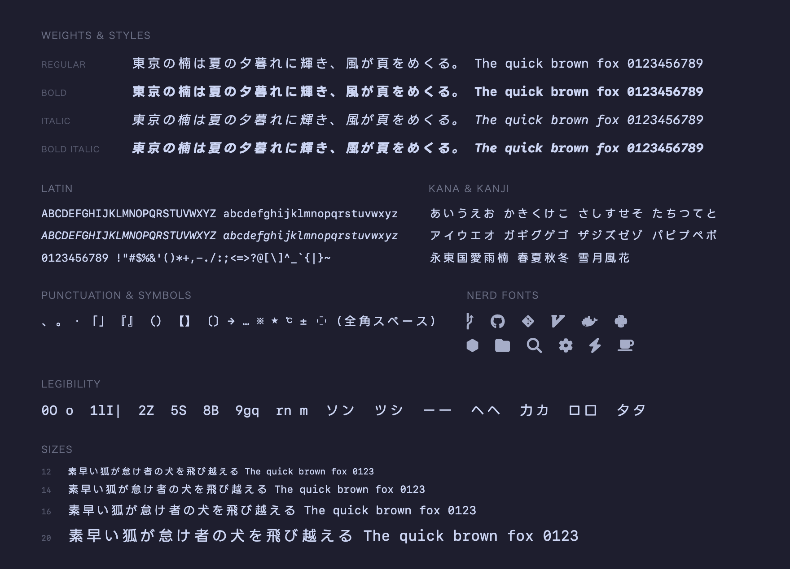
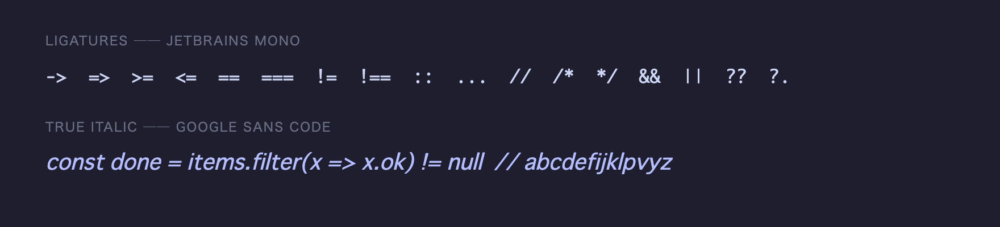
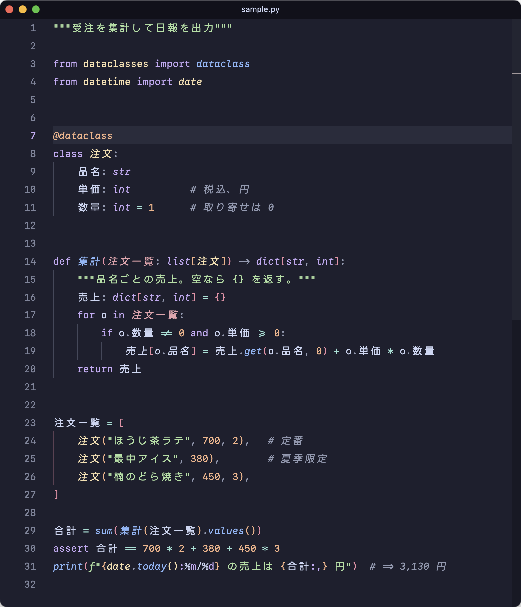

<div align="center">


[English](README.md) | 日本語


SF Mono を正方グリッドに詰め、LINE Seed JP を重ねた、自分でビルドする日本語コーディングフォント。



</div>

## 特徴

- 半角 1 : 全角 2 の固定グリッド。日本語とコードが揃う
- 英数字は Apple **SF Mono**、和文は **LINE Seed JP** (フォールバックは Migu 1M)
- **JetBrains Mono** のプログラミングリガチャ
- **Google Sans Code** の true italic
- **Nerd Fonts** アイコン (SF Mono Square と同サイズ)




## エディタでの表示



## インストール (macOS)

出力には Apple SF Mono が含まれるため配布せず、手元でビルドします ([SF Mono Square][sfms] と同方式)。

```sh
brew tap peinan/kusunoki-mono
brew install kusunoki-mono
cp "$(brew --prefix)/share/fonts/KusunokiMono-"*.otf ~/Library/Fonts/
```

端末やエディタのフォントを **Kusunoki Mono** に設定すれば完了です。

<details>
<summary><b>make でビルドする (調整ノブを使う場合)</b></summary>

必要なもの: macOS、[Homebrew][brew]、[`uv`][uv]

```sh
brew install fontforge
make setup   # ソースフォントと nerd-fonts patcher を取得
make build   # → build/sfms/dist/KusunokiMono-{Regular,Bold,Italic,BoldItalic}.otf
cp build/sfms/dist/KusunokiMono-*.otf ~/Library/Fonts/
```

`make build` の環境変数です。
Homebrew 経由では独自の環境変数が渡らないため、ノブを変えるときはこちらでビルドします。

| 変数 | 既定値 | 効果 |
| --- | --- | --- |
| `JP_SCALE` | `0.82` | 和文の光学サイズ |
| `LIG_YSCALE` | `1.478` | リガチャの高さ。既定値は `//` など背の高い演算子が SF Mono の `/` に揃う値 |
| `ITALIC_INK_OFFSET` | `0.0` | italic 英字のインク位置。セル幅比で `0` は upright と同じ中央、`0.076` は SF Mono 本来の右寄り |
| `GSC_R` / `GSC_B` | `360` / `650` | 移植する italic 文字の Google Sans Code ウェイト |
| `KM_AMBIGUOUS_WIDTH` | `narrow` | ※ ★ ℃ など曖昧幅記号のセル数。`narrow` は 1 セルで Ghostty など厳密な端末でも被らず、`wide` は SF Mono Square と同じ 2 セル |
| `KM_SFMS_DIR` | `~/Library/Fonts` | アイコンのサイズ合わせに使う `SFMonoSquare-*.otf` の場所。無ければこの工程はスキップ |

</details>

## 開発

パイプラインの内部は [docs/development.ja.md](docs/development.ja.md) にまとめています。

## ライセンス

ビルド済みフォントは Apple SF Mono を含む、個人用で再配布不可の成果物です。
ソースフォントは各々のライセンスに従います。
ビルドスクリプトは作者のものです。

| ソース | ライセンス |
| --- | --- |
| SF Mono | © Apple |
| Migu 1M | M+ / IPA |
| LINE Seed JP | OFL 1.1 |
| Google Sans Code | OFL 1.1 |
| JetBrains Mono | OFL 1.1 |
| Nerd Fonts | MIT + upstream |

[sfms]: https://github.com/delphinus/homebrew-sfmono-square
[brew]: https://brew.sh/
[uv]: https://docs.astral.sh/uv/
