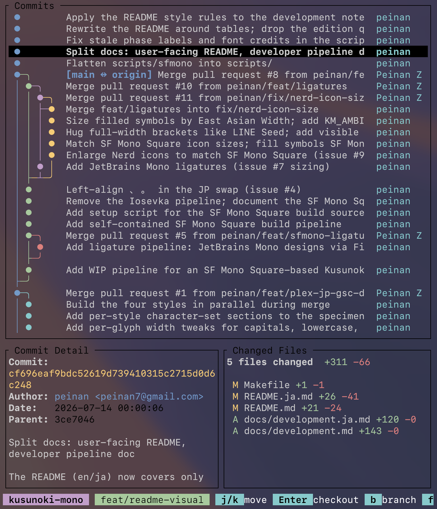
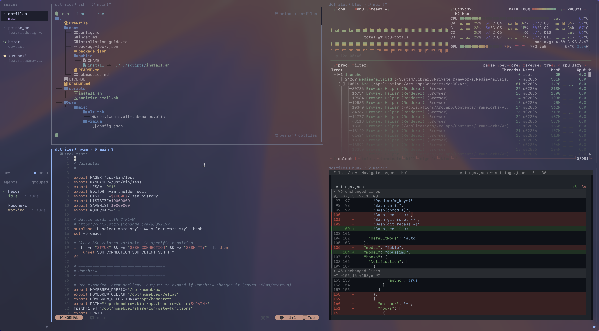

<div align="center">


English | [日本語](README.ja.md)


[](https://github.com/peinan/homebrew-kusunoki-mono)

Apple's beautifully crafted SF Mono, squared onto a Japanese-aligned grid and
layered with LINE Seed JP, which stays crisp at small sizes. The italic is
Google Sans Code's, hand-picked letter by letter to sit well with SF Mono —
with JetBrains Mono ligatures and Nerd Fonts icons built in.

</div>

## Features

- Fixed 1:2 grid — a full-width CJK glyph is exactly two columns, so Japanese and code stay aligned
- Apple **SF Mono** for Latin, **LINE Seed JP** for Japanese (Migu 1M as the fallback)
- Enlarged dakuten and handakuten with a MigMix-style skip-ink gap, so ば ぱ ぼ ぽ stay apart at small sizes
- **JetBrains Mono** programming ligatures
- **Google Sans Code** true italic
- **Nerd Fonts** icons


## Install

The output embeds Apple SF Mono, so no binaries are distributed — it builds on your Mac.

```sh
brew tap peinan/kusunoki-mono
brew install kusunoki-mono
cp "$(brew --prefix)/share/fonts/KusunokiMono-"*.otf ~/Library/Fonts/
```

On Homebrew 6.0+, third-party taps must be trusted once before the first
install: `brew trust peinan/kusunoki-mono`.

Set your terminal or editor font to **Kusunoki Mono**.

### Build with make

To tweak the font, build with make — the knobs below are env vars for `make build`.
Requirements: [Homebrew][brew], [`uv`][uv]

```sh
brew install fontforge
make setup   # fetch the source fonts and the nerd-fonts patcher
make build   # → dist/KusunokiMono-{Regular,Bold,Italic,BoldItalic}.otf
cp dist/KusunokiMono-*.otf ~/Library/Fonts/
```

| Variable | Default | Effect |
| --- | --- | --- |
| `JP_SCALE` | `0.82` | Japanese optical size |
| `LIG_YSCALE` | `1.478` | Ligature height; the default matches tall operators like `//` to SF Mono's `/` |
| `ITALIC_INK_OFFSET` | `0.0` | Italic Latin ink offset as a fraction of the cell; `0` is centred like the upright, `0.076` is SF Mono's native right-lean |
| `GSC_R` / `GSC_B` | `360` / `650` | Google Sans Code weights for the grafted italic letters |
| `KM_DAKUTEN_SCALE` / `KM_HANDAKUTEN_SCALE` | `1.3` / `1.25` | Dakuten / handakuten enlargement on kana |
| `KM_DAKUTEN_HALO` / `KM_HANDAKUTEN_HALO` | `0.40` / `0.30` | Skip-ink gap carved around the enlarged mark, as a fraction of it; `KM_DAKUTEN_SKIP_INK=0` disables the carve |
| `KM_AMBIGUOUS_WIDTH` | `narrow` | Cells for East-Asian-ambiguous symbols like ※ ★ ℃; `narrow` is 1 cell and safe in strict terminals like Ghostty, `wide` is 2 cells |
| `KM_SFMS_DIR` | `~/Library/Fonts` | Where `SFMonoSquare-*.otf` lives, used to size icons to match; the step is skipped if absent |

## Development

Pipeline internals are documented in [docs/development.md](docs/development.md).

## Screenshots

| | |
| --- | --- |
|  |  |



## Licensing

The built font contains Apple SF Mono and is a personal, non-redistributable
artifact. The source fonts keep their own licenses; the build scripts here
are the author's own.

| Source | License |
| --- | --- |
| SF Mono | © Apple |
| Migu 1M | M+ / IPA |
| LINE Seed JP | OFL 1.1 |
| Google Sans Code | OFL 1.1 |
| JetBrains Mono | OFL 1.1 |
| Nerd Fonts | MIT + upstream |

[brew]: https://brew.sh/
[uv]: https://docs.astral.sh/uv/
