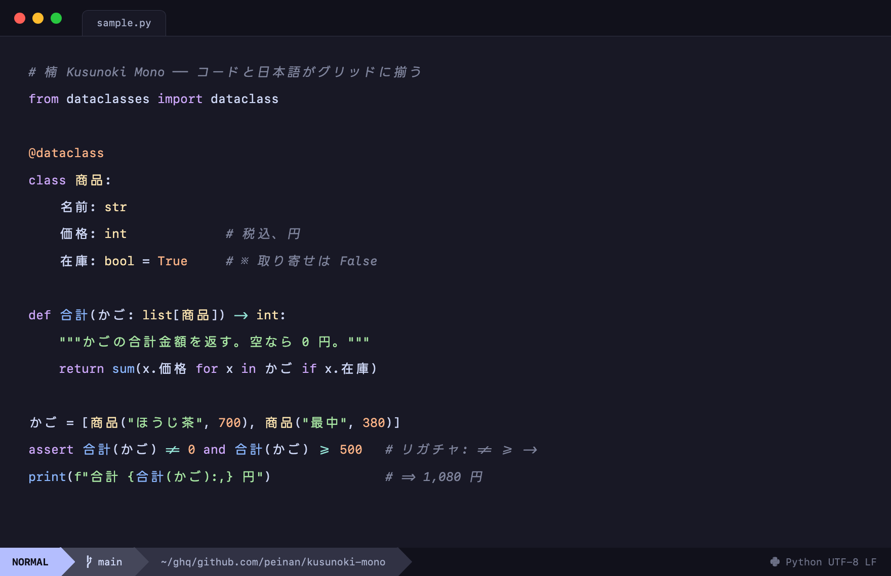

<div align="center">


English | [日本語](README.ja.md)


A Japanese coding font you build yourself: SF Mono condensed to a square
grid, layered with LINE Seed JP.



</div>

## Features

- Fixed 1:2 grid — a full-width CJK glyph is exactly two columns, so Japanese and code stay aligned
- Apple **SF Mono** for Latin, **LINE Seed JP** for Japanese (Migu 1M as the fallback)
- **JetBrains Mono** programming ligatures
- **Google Sans Code** true italic
- **Nerd Fonts** icons, sized to match SF Mono Square


## Install (macOS)

The output embeds Apple SF Mono, so no binaries are distributed — it builds
on your Mac, the same way [SF Mono Square][sfms] does.

```sh
brew tap peinan/kusunoki-mono
brew install kusunoki-mono
cp "$(brew --prefix)/share/fonts/KusunokiMono-"*.otf ~/Library/Fonts/
```

Set your terminal or editor font to **Kusunoki Mono**.

<details>
<summary><b>Build with make (for the tuning knobs)</b></summary>

Requirements: macOS, [Homebrew][brew], [`uv`][uv]

```sh
brew install fontforge
make setup   # fetch the source fonts and the nerd-fonts patcher
make build   # → build/sfms/dist/KusunokiMono-{Regular,Bold,Italic,BoldItalic}.otf
cp build/sfms/dist/KusunokiMono-*.otf ~/Library/Fonts/
```

Env vars for `make build`; Homebrew scrubs custom env vars, so tune via
this route:

| Variable | Default | Effect |
| --- | --- | --- |
| `JP_SCALE` | `0.82` | Japanese optical size |
| `LIG_YSCALE` | `1.478` | Ligature height; the default matches tall operators like `//` to SF Mono's `/` |
| `ITALIC_INK_OFFSET` | `0.0` | Italic Latin ink offset as a fraction of the cell; `0` is centred like the upright, `0.076` is SF Mono's native right-lean |
| `GSC_R` / `GSC_B` | `360` / `650` | Google Sans Code weights for the grafted italic letters |
| `KM_AMBIGUOUS_WIDTH` | `narrow` | Cells for East-Asian-ambiguous symbols like ※ ★ ℃; `narrow` is 1 cell and safe in strict terminals like Ghostty, `wide` is 2 cells like SF Mono Square |
| `KM_SFMS_DIR` | `~/Library/Fonts` | Where `SFMonoSquare-*.otf` lives, used to size icons to match; the step is skipped if absent |

</details>

## Development

Pipeline internals are documented in [docs/development.md](docs/development.md).

## Licensing

The built font contains Apple SF Mono and is a personal, non-redistributable
artifact. The source fonts keep their own licenses; the build scripts here
are the author's own.

| Source | License |
| --- | --- |
| SF Mono | © Apple |
| Migu 1M | M+ / IPA |
| LINE Seed JP | OFL 1.1 |
| Google Sans Code | OFL 1.1 |
| JetBrains Mono | OFL 1.1 |
| Nerd Fonts | MIT + upstream |

[sfms]: https://github.com/delphinus/homebrew-sfmono-square
[brew]: https://brew.sh/
[uv]: https://docs.astral.sh/uv/
